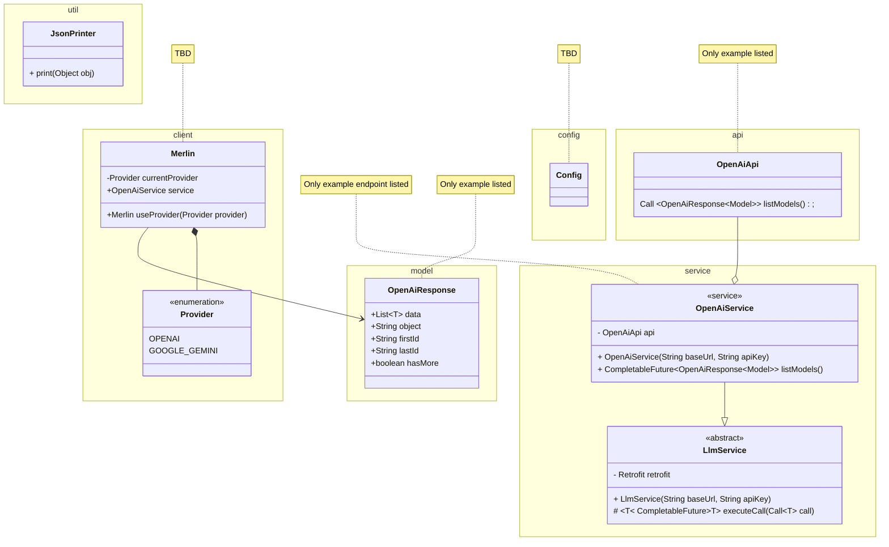

# Merlin

Merlin is a Java library that provides a unified interface to interact with LLMs.

## Project Overview

| Libraries used                                           | Description                                                                           |
| -------------------------------------------------------- | ------------------------------------------------------------------------------------- |
| [okhttp](https://github.com/square/okhttp)               | OkHttp is an HTTP client.                                                             |
| [log4j](https://logging.apache.org/log4j/2.x/index.html) | Apache Log4j is a versatile, industrial-grade Java logging framework.                 |
| [jackson](https://github.com/FasterXML/jackson)          | Jackson has been known as "the Java JSON library" or "the best JSON parser for Java". |
| [lombok](https://projectlombok.org/)                     | Lombok is a java library that automatically plugs into the editor and build tools.    |
| [JUnit5](https://junit.org/junit5/)                      | JUnit is a simple framework to write repeatable tests.                                |
| [Mockito](https://site.mockito.org/)                     | Mockito is a mocking framework that tastes really good.                               |

- OpenAI notice:
  - Deprecated and legacy features are not supported.

## User stories

> Expected to change during development. Some user stories might be broken down into smaller user stories.

| 1. Basic Integration                                                                                                              | Must have                                                                                                                                                                                                            |
| --------------------------------------------------------------------------------------------------------------------------------- | -------------------------------------------------------------------------------------------------------------------------------------------------------------------------------------------------------------------- |
| "As a developer, I want to integrate various LLMs into my Java application using Merlin, so I can use multiple AI models easily." | **Acceptance Criteria:** The library should provide a simple API to connect to at least three different LLM providers (e.g., OpenAI, Google Gemini, Ollama). The API should be well-documented with usage examples." |

| 2. Sending Requests                                                                                                                        | Must have                                                                                                                                                                                                               |
| ------------------------------------------------------------------------------------------------------------------------------------------ | ----------------------------------------------------------------------------------------------------------------------------------------------------------------------------------------------------------------------- |
| "As a developer, I want to send text queries to an LLM and receive responses, so I can utilize the AI capabilities within my application." | **Acceptance Criteria:** The library should support sending a text query to a connected LLM. The library should return the LLM’s response in a standard format. The response time should be optimized for performance." |

| 3. Handling Multiple Models                                                                                        | Must have                                                                                                                  |
| ------------------------------------------------------------------------------------------------------------------ | -------------------------------------------------------------------------------------------------------------------------- |
| "As a developer, I want to switch between different LLMs seamlessly, so I can choose the best model for my needs." | **Acceptance Criteria:** The library should support switching between different LLM providers without major code changes." |

| 4. Error Handling                                                                                                                 | Must have                                                                                                                                                                                                          |
| --------------------------------------------------------------------------------------------------------------------------------- | ------------------------------------------------------------------------------------------------------------------------------------------------------------------------------------------------------------------ |
| "As a developer, I want robust error handling when making API calls, so I can ensure my application handles failures gracefully." | **Acceptance Criteria:** The library should provide clear error messages for different failure scenarios (e.g., network issues, API rate limits). The library should offer retry mechanisms and fallback options." |

| 5. Logging and Monitoring                                                                                                       | Must have                                                                                                                                                                                                                            |
| ------------------------------------------------------------------------------------------------------------------------------- | ------------------------------------------------------------------------------------------------------------------------------------------------------------------------------------------------------------------------------------ |
| "As a developer, I want to log API requests and responses, so I can monitor the usage and performance of the LLM integrations." | **Acceptance Criteria:** The library should integrate with a logging framework log4j to log all API interactions. The logs should include relevant information like request timestamps, response times, and any errors encountered." |

| 6. Security                                                                                                   | Must have                                                                                                                                                                                       |
| ------------------------------------------------------------------------------------------------------------- | ----------------------------------------------------------------------------------------------------------------------------------------------------------------------------------------------- |
| "As a developer, I want to securely handle API keys and credentials, so I can protect sensitive information." | **Acceptance Criteria:** The library should provide secure methods to store and use API keys. The library should ensure that sensitive information is not logged or exposed in error messages." |

| 7. Configuration Management                                                                                | Must have                                                                                                                                                                  |
| ---------------------------------------------------------------------------------------------------------- | -------------------------------------------------------------------------------------------------------------------------------------------------------------------------- |
| "As a developer, I want to configure the library easily, so I can adjust settings without modifying code." | **Acceptance Criteria:** The library should support configuration through properties files or environment variables. The configuration options should be well-documented." |

| 8. Documentation                                                                                                                   | Must have                                                                                                                                                                                                                                           |
| ---------------------------------------------------------------------------------------------------------------------------------- | --------------------------------------------------------------------------------------------------------------------------------------------------------------------------------------------------------------------------------------------------- |
| "As a developer, I want comprehensive documentation and example receipes, so I can understand how to use the library effectively." | **Acceptance Criteria:** The library should include a detailed README file with installation instructions. There should be example projects demonstrating common use cases. The API should be well-documented with usage examples for each method." |

| 9. Asynchronous Operations                                                                                         | Must have                                                                                                                                                                                                                 |
| ------------------------------------------------------------------------------------------------------------------ | ------------------------------------------------------------------------------------------------------------------------------------------------------------------------------------------------------------------------- |
| "As a developer, I want to perform asynchronous API calls, so I can improve the responsiveness of my application." | **Acceptance Criteria:** The library should support asynchronous requests and provide callback mechanisms. The library should allow for easy integration with Java’s CompletableFuture or similar concurrency utilities." |

## UML Diagram

