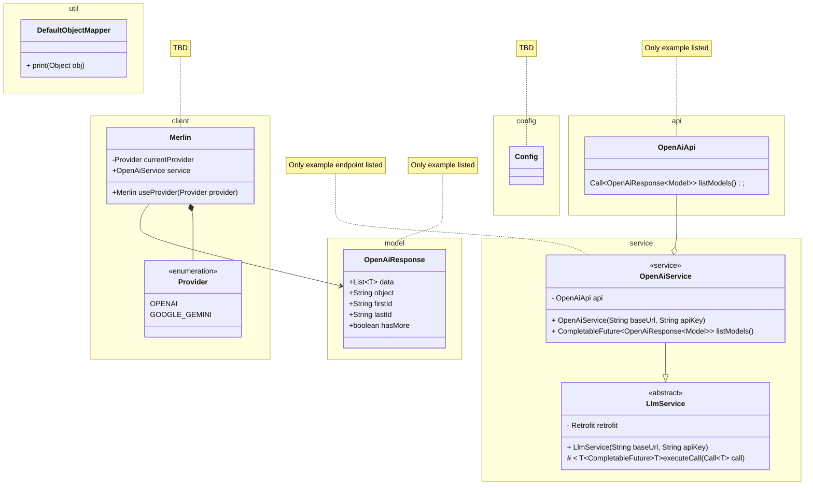

# Merlin

Merlin is a Java util library that provides an unified interface to interact with Large Language Models (LLMs).

| Libraries used                                                   |
| ---------------------------------------------------------------- |
| [okhttp](https://github.com/square/okhttp)                       |
| [log4j](https://logging.apache.org/log4j/2.x/index.html)         |
| [SLF4J](https://www.slf4j.org/index.html)                        |
| [jackson](https://github.com/FasterXML/jackson)                  |
| [lombok](https://projectlombok.org/)                             |
| [RxJava](https://github.com/ReactiveX/RxJava?tab=readme-ov-file) |
| [JUnit5](https://junit.org/junit5/)                              |

## Features

> OpenAI: deprecated and legacy features are not supported

> Google Gemini: currently supports `v1` endpoints.

TBA

## Getting Started

### Add Merlin to your project

#### Maven

```xml
<dependency>
    <groupId>io.github.jkmeansesc</groupId>
    <artifactId>merlin</artifactId>
    <version>0.1.0</version>
</dependency>
```

#### Gradle

```gradle
implementation group: 'io.github.jkmeansesc', name: 'merlin', version: '0.1.0'
```

#### Jar

Download the latest JAR file [here](dist/), and import it into your project manually.

### Initialize Merlin

Merlin utilizes builder pattern for a consistent and flexible initialization of all supported LLM services. You can initialize any supported LLM service like this:

```java
        Merlin merlin = Merlin
                .builder()
                .openai()
                .gemini()
                .ollama()
                .build();

        OpenAiService openAiService = merlin.getService(OpenAiService.class);
        GeminiService geminiService = merlin.getService(GeminiService.class);
        OllamaService ollamaService = merlin.getService(OllamaService.class);
```

If you only need a specific service, you can initialize it directly:

```java
        OpenAiService openAiService = Merlin.openai().build().getService(OpenAiService.class);
```

Merlin supports API key management through environment variables. By default, Merlin will look for API keys through environment variables and fall back to direct initialization. If neither is found, an Exception will be thrown.

| Provider       | Environment Variable |
| -------------- | -------------------- |
| OpenAI ChatGPT | `OPENAI_KEY`         |
| Goole Gemini   | `GOOGLE_GEMINI_KEY`  |
| Ollama         | Not Applicable       |

Or you can supply an API key directly through initialization.

## Contributing

Contributions are welcome! Please submit a pull request or open an issue to discuss what you would like to change.

## License

This project is licensed under the MIT License - see the [LICENSE](LICENSE) file for details.

## For dissertation purposes

### User stories

| 1. Basic Integration                                                                                                              | Must have                                                                                                                                                                                                            |
| --------------------------------------------------------------------------------------------------------------------------------- | -------------------------------------------------------------------------------------------------------------------------------------------------------------------------------------------------------------------- |
| "As a developer, I want to integrate various LLMs into my Java application using Merlin, so I can use multiple AI models easily." | **Acceptance Criteria:** The library should provide a simple API to connect to at least three different LLM providers (e.g., OpenAI, Google Gemini, Ollama). The API should be well-documented with usage examples." |

| 2. Sending Requests                                                                                                                        | Must have                                                                                                                                                                                                               |
| ------------------------------------------------------------------------------------------------------------------------------------------ | ----------------------------------------------------------------------------------------------------------------------------------------------------------------------------------------------------------------------- |
| "As a developer, I want to send text queries to an LLM and receive responses, so I can utilize the AI capabilities within my application." | **Acceptance Criteria:** The library should support sending a text query to a connected LLM. The library should return the LLM’s response in a standard format. The response time should be optimized for performance." |

| 3. Handling Multiple Models                                                                                        | Must have                                                                                                                  |
| ------------------------------------------------------------------------------------------------------------------ | -------------------------------------------------------------------------------------------------------------------------- |
| "As a developer, I want to switch between different LLMs seamlessly, so I can choose the best model for my needs." | **Acceptance Criteria:** The library should support switching between different LLM providers without major code changes." |

| 4. Error Handling                                                                                                                 | Must have                                                                                                                                                                                                          |
| --------------------------------------------------------------------------------------------------------------------------------- | ------------------------------------------------------------------------------------------------------------------------------------------------------------------------------------------------------------------ |
| "As a developer, I want robust error handling when making API calls, so I can ensure my application handles failures gracefully." | **Acceptance Criteria:** The library should provide clear error messages for different failure scenarios (e.g., network issues, API rate limits). The library should offer retry mechanisms and fallback options." |

| 5. Logging and Monitoring                                                                                                       | Must have                                                                                                                                                                                                                            |
| ------------------------------------------------------------------------------------------------------------------------------- | ------------------------------------------------------------------------------------------------------------------------------------------------------------------------------------------------------------------------------------ |
| "As a developer, I want to log API requests and responses, so I can monitor the usage and performance of the LLM integrations." | **Acceptance Criteria:** The library should integrate with a logging framework log4j to log all API interactions. The logs should include relevant information like request timestamps, response times, and any errors encountered." |

| 6. Security                                                                                                   | Must have                                                                                                                                                                                       |
| ------------------------------------------------------------------------------------------------------------- | ----------------------------------------------------------------------------------------------------------------------------------------------------------------------------------------------- |
| "As a developer, I want to securely handle API keys and credentials, so I can protect sensitive information." | **Acceptance Criteria:** The library should provide secure methods to store and use API keys. The library should ensure that sensitive information is not logged or exposed in error messages." |

| 7. Configuration Management                                                                                | Must have                                                                                                                                                                  |
| ---------------------------------------------------------------------------------------------------------- | -------------------------------------------------------------------------------------------------------------------------------------------------------------------------- |
| "As a developer, I want to configure the library easily, so I can adjust settings without modifying code." | **Acceptance Criteria:** The library should support configuration through properties files or environment variables. The configuration options should be well-documented." |

| 8. Documentation                                                                                                                   | Must have                                                                                                                                                                                                                                           |
| ---------------------------------------------------------------------------------------------------------------------------------- | --------------------------------------------------------------------------------------------------------------------------------------------------------------------------------------------------------------------------------------------------- |
| "As a developer, I want comprehensive documentation and example receipes, so I can understand how to use the library effectively." | **Acceptance Criteria:** The library should include a detailed README file with installation instructions. There should be example projects demonstrating common use cases. The API should be well-documented with usage examples for each method." |

| 9. Asynchronous Operations                                                                                         | Must have                                                                                                                                                                                                                 |
| ------------------------------------------------------------------------------------------------------------------ | ------------------------------------------------------------------------------------------------------------------------------------------------------------------------------------------------------------------------- |
| "As a developer, I want to perform asynchronous API calls, so I can improve the responsiveness of my application." | **Acceptance Criteria:** The library should support asynchronous requests and provide callback mechanisms. The library should allow for easy integration with Java’s CompletableFuture or similar concurrency utilities." |

### UML Diagram



### Dev Logs

#### 2024-06-14

Project needs more clarifications, needs to show more value.

- [x] write up a document explaining what the project is all about

#### 2024-06-20

Project is approved. Do this for the next week:

- [x] naming the project
- [x] set up a Gitlab repository
- [x] start writing user stories
- [x] start designing
- [x] start building
- [x] send a weekly update next Wednesday
- [x] wait for an online meeting invite next Thursday, it's gonna be short since supervisor is on leave
- [x] fill out project tracker

Leave at least 3 weeks to start writing dissertation.

#### 2024-07-06

- added OpenAI endpoints for images.
- added OpenAI endpoints for files.
- added OpenAI endpoints for models.
- added OpenAI endpoints for moderations.
- added key management service: can read from environment variable or a given string directly.
- created `SecureLoggingInterceptor` to mask sensitive headers.
- set up `JUnit 5` for testing.
- introduced logging framework.
- created inner class to group test cases.
- switched to SLF4J to provide more flexibility instead of Log4j 2.
- solved console not logging "application/json" header defined in Retrofit interface.
- solved Okhttp request serializing null fields into payload.]]

I don't need to handle `Content-Type` explicitly, `Okhttp` will check what I'm sending and update the headers
accordingly.

- added `FileParser` util to parse a `File` object into a `RequestBody`
- dropped custom logging interceptor, use `HttpLoggingInterceptor` instead.

#### 2024-07-07

- added OpenAI endpoints for audios.

#### 2024-07-11

Chat Completion Object is provided in a single, complete object, received after the model has finished generating the
entire response. Chat Completion Chunk Object is split into multiple parts (chunks) and sent incrementally, received in
real-time as the model generates the response, chunk by chunk, allowing for incremental processing.

Trying to find a way to stream and model the endpoints for chat.

Understanding what is backpressure, which is the remote producing response faster than the local can process.

#### 2024-07-12

- added OpenAI endpoints and models for chat.
- added OpenAI endpoints and models for embeddings.
- added OpenAI endpoints and models for fine-tuning.
- added OpenAI endpoints and models for batch.

#### 2024-07-13

If a request has query parameters, provide a default method to call without them and one with all of them. When calling
with query params, set null to the ones you don't need, Retrofit will ignore them in the call.

- added OpenAI endpoints and models for Vector Store.
- added OpenAI endpoints and models for Vector Store Files.
- added OpenAI endpoints and models for Vector Store File Batches.

Many fields accept both String or a structured object, need to find a way to accommodate this.

Figured out how to use Jackson's polymorphic deserialization.

#### 2024-07-14

- refactored model classes to accommodate fields accepting multiple types with custom serializers.
- added Serializers util class to keep custom serializers in one place. Registered custom serializers in the Retrofit
  builder.
- added OpenAI endpoints and models for Assistants.
- added OpenAI endpoints and models for Threads.
- added OpenAI endpoints and models for Messages.
- added OpenAI endpoints and models for Runs.
- added OpenAI endpoints and models for Run Step.

#### 2024-07-15

- finished modeling for OpenAI endpoints

#### 2024-07-17

- added support for Google Gemini.
- added Google Gemini endpoints and models for Models.
- finished modeling for Google Gemini endpoints `v1`.

May need to think about the naming strategy for models since different providers can have the same model names.

#### 2024-07-18

- added support for Ollama.
- added Ollama endpoints and models.
- overhauled Llmconfig, now it can take a default json config or an arbitrary json file path supplied by user.
- refactored Merlin. Now it puts LlmService into a list.

#### 2024-07-22

There are still some challenges to solve.

1. [x] add support for rate limiting, preferably integrate into service initialization.
2. [x] solve streaming, currently I have a unified `StreamingResponse<T>`, but it's not tested and need refinement.
3. [x] need to figure out how to handle backpressure when streaming. Backpressure is a term used to describe the
       situation where the remote is producing responses faster than the local can process. This can lead to memory leaks
       and other issues.
4. [x] google Gemini's documentation has been updated and introduced various new endpoints and dropped support for `v1`,
       need to update the endpoints completely.

Trying to complete the project this week. Then start writing the dissertation.

In the future, I might change the modeling strategy for LLMs because currently the models are too cumbersome to maintain
and don't support for parallel calls. But this is beyond the scope of the dissertation because it requires an overhaul
of the models. I can provider ways to initiate parallel calls but the code will be cumbersome and far from elegant.

- updated some logging logic.

#### 2024-07-24

- added support for connection pool and timeout. It now reads "time_out" field from config file and fallback to default
  of 10 seconds.
- [x] need to add more error handling logic, maybe not throwing exception but return a error response model.
- refined error handling, it now throws an `LlmApiException` wrapped in a `CompletionException`.
- fixed a problem where `createBlob()` for Ollama getting checksum mismatch error.
- refined Merlin.java. Now it uses Map instead of List.
- moved internal implementations into an `internal` package

#### 2024-07-26

- introduce RxJava to handle streaming and backpressure.

#### 2024-07-27

- overhauled the entire `LlmConfig`. Ditched the reading from a file approach, instead use a config class to manage the
  configuration.
- updated some Javadoc.
- switched to WireMock for mocking responses.
- finished unit testing for Ollama.

#### 2024-07-29

- refactored streaming logic.
- update OpenAI models.
- update utility class.
- fix a problem where OpenAI stream is not handled properly.

#### 2024-07-30

- update OpenAI unit test.
- fix a problem where deserialization not setting `type` field for some models.
- finished unit testing for OpenAI.

#### 2024-08-02

- update Google Gemini models.

#### 2024-08-03

- finished unit testing for Google Gemini.

### Future plans

- [ ] create Server Sent Event (SSE) representations for streaming different LLMs.
- [ ] parallel calling.
- [ ] retry logic.
- [ ] accumulate streaming responses to a single object.

[Semantic Versioning](https://semver.org/)
